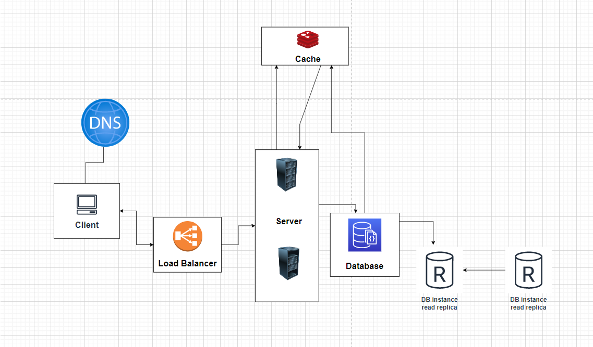

➡️ [Google Drive Link To Diagram](https://drive.google.com/file/d/1YOCIo0v50yFdBXPau8QC8FnrttC5NrHk/view?usp=sharing)

This system architecture diagram depicts the various entities that are typically involved in building a web application. The different entities are:

1. DNS Server: This is responsible for translating human-readable domain names into IP addresses that computers can use to locate servers hosting web applications.

2. Client-side: This refers to the user's web browser or device that they are using to access the web application.

3. Web Server: This entity is responsible for hosting and serving web pages and other resources to clients over the internet. It can be a simple server that handles HTTP requests and serves static content, or a more complex application server that executes server-side scripts and interacts with a database.

4. Database Layer: The database layer of a web application typically consists of one or more database servers that store and manage the application's data.

5. Load Balancer: A load balancer is responsible for distributing incoming traffic to multiple web servers, which helps to improve the performance, scalability, and availability of the application.

6. Read Replica: A read replica is a copy of the master database server that is used to handle read requests from clients, while the master database server handles write requests. This helps to improve the performance and scalability of the application by offloading read requests from the master database server.

7. Caching Layer: A caching layer is responsible for storing frequently accessed data in memory, which helps to improve the performance of the application by reducing the number of requests that need to be made to the database server.

8. Content Delivery Network (CDN): A CDN is a network of distributed servers that are responsible for serving static content, such as images, videos, and other files, to clients. It helps to improve the performance and availability of the application by reducing the amount of time it takes to load static content, especially for clients that are geographically far away from the application's servers.

Each of these entities serves a specific purpose in the overall architecture of a web application and can be implemented using a variety of technologies and tools, depending on the specific needs of the application.

Creating a simple server with a DNS and client side is the first step in building a web application. Adding a database layer is necessary for storing and managing the application's data. As the application grows, a load balancer can be added to distribute incoming traffic to multiple web servers, providing better performance and scalability. Read replicas can be added to handle read requests from clients and caching can be added to store frequently accessed data in memory, further improving performance. Finally, a CDN can be added to serve static content to clients, improving performance and availability for users.

Overall, this system architecture diagram provides a high-level view of the various components that are required to build a modern web application, and how they can be integrated to create a scalable, high-performance, and reliable application.

➡️ [Link To Video explaining how we would scale a website from a simple website to a more stable system](https://drive.google.com/file/d/1aWBa8snk-UICpviqpJ_tKvm4LYKPbMid/view?usp=share_link)