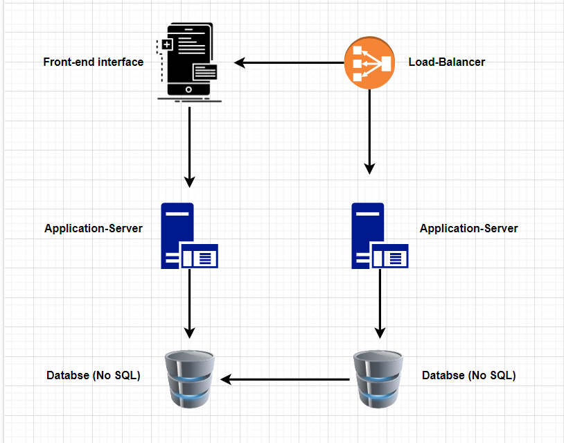

➡️ [Google Drive Link For Diagram](https://drive.google.com/file/d/1ifiyMMTHPfqecXuyvp4YjmKfJoBioaCL/view?usp=sharing)

**URL Shortener Service**

The URL Shortener Service is a web-based application that takes in a long URL and generates a short URL that redirects to the original long URL. The service is designed to make long URLs more manageable and easier to share.

💡**Features**

1. Generates short URLs that redirect to the original long URL
2. Handles high traffic and at least 10 million unique URLs per month
3. Uses a combination of a hash function and an encoding algorithm to generate short URLs
4. Stores the URLs and their associated metadata in a NoSQL database, such as MongoDB or Cassandra
5. Implements a redirect system using a load balancer and multiple servers

💡**Installation**

To install the URL Shortener Service, follow these steps:
1. Clone the repository to your local machine
2. Install the required dependencies using npm install
3. Set up a NoSQL database, such as MongoDB or Cassandra
4. Configure the database connection in the .env file
5. Start the server using npm start

💡**Usage**

To use the URL Shortener Service, follow these steps:
1. Navigate to the web-based interface
2. Enter a long URL that you want to shorten
3. Click on the "Shorten" button to generate a short URL
4. Share the short URL with others

💡**Contributing**

If you would like to contribute to the URL Shortener Service, please follow these guidelines:
1. Fork the repository
2. Create a new branch for your feature or bug fix
3. Make your changes and test them thoroughly
4. Submit a pull request

➡️ [Video: How we would approach a problem like URL shortener](https://drive.google.com/file/d/1V6PrCy5GjbV2ln0XrMNkBY607GRrgftp/view?usp=share_link)
